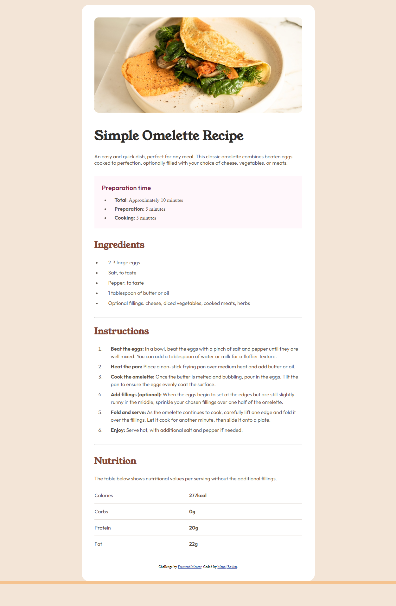

# Frontend Mentor - Recipe page solution

This is a solution to the [Recipe page challenge on Frontend Mentor](https://www.frontendmentor.io/challenges/recipe-page-KiTsR8QQKm). Frontend Mentor challenges help you improve your coding skills by building realistic projects. 

## Table of contents

- [Overview](#overview)
  - [The challenge](#the-challenge)
  - [Screenshot](#screenshot)
  - [Links](#links)
- [My process](#my-process)
  - [Built with](#built-with)
  - [What I learned](#what-i-learned)
  - [Continued development](#continued-development)
  
- [Author](#author)

**Note: Delete this note and update the table of contents based on what sections you keep.**

## Overview

### Screenshot

### Links

- Solution URL: [Add solution URL here](https://github.com/manojaba/Recipe-Page)
- Live Site URL: [Add live site URL here](https://manojaba.github.io/Recipe-Page/)

## My process
I started building the recipe page by following the layer arrangements from the design file which I used as a markup nesting.Then started styling each section in an order from top to bottom.

### Built with

- Semantic HTML5 markup
- CSS custom properties
- CSS Grid

### What I learned

It was fun writing the markup following the design file.I had inital challenges to match the border and padding of the design.designing a responsive layout was a little tricky and had initial  struggle while styling columns.

### Continued development

I would like to get more practice in resposive layout and positioning elements in different browser widths.

## Author

- Website - [Manoj Baskar](https://github.com/manojaba)
- Frontend Mentor - [@manojaba](https://www.frontendmentor.io/profile/manojaba)
- Linkedin- [Manoj Baskar](https://www.linkedin.com/in/manoj-baskar-42a734159/)

